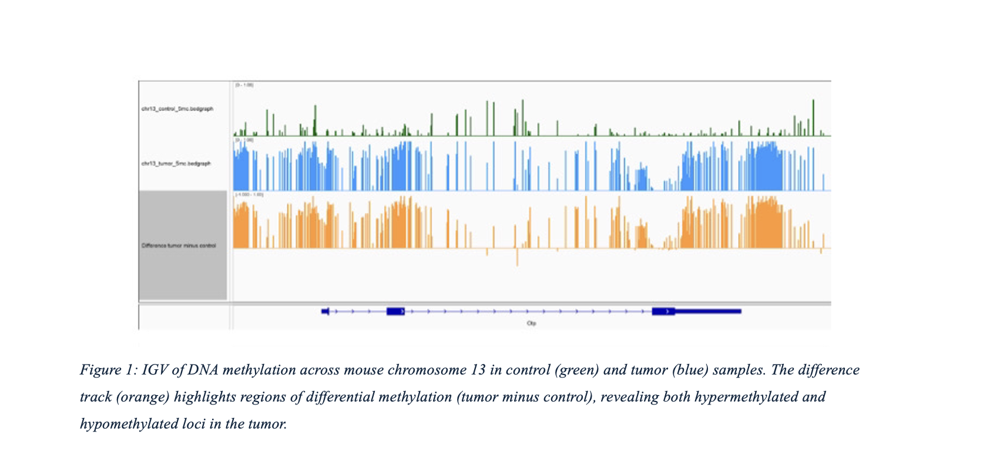

<meta name="viewport" content="width=device-width, initial-scale=1.0, maximum-scale=1.0, user-scalable=no, shrink-to-fit=no, viewport-fit=cover">

# Aspiring Health Data Scientist & Bioinformatician

📍 United States

Hi, I’m Neela. I am a data enthusiast studying Applied Mathematics with a Bioinformatics minor at Texas A&M. I work at the intersection of math, biology, and tech, with experience in NGS data processing, differential expression analysis, and building custom Python/R pipelines. My focus is on data science, biostatistics, and healthcare equity. I plan to pursue a master’s in computational biology or bioinformatics to further this work.

## Education

| Degree | Institution | Year |
|:------:|:----------:|:----:|
| BSc., Applied Mathematics (BIO); Bioinformatics Minor | Texas A&M University | May 2026 |

## Skills

* **Programming Languages**: Python, R, SQL, JavaScript, MATLAB
* **Data Analysis**: Pandas, PySpark, NumPy, Matplotlib
* **Machine Learning**: Scikit-learn, TensorFlow
* **Data Visualization**: Tableau, Power BI 
* **AI/ML**: LLMs, Speech Recognition, APIs
* **Tools**: Git, GitHub, VSCode, Google Cloud Platform

---

## Featured Projects

### 1. Transcriptomic Analysis of Mouse Cancer Models

* **Description**: Analyzed long-read RNA sequencing data from tumor and control tissue samples in a mouse model to investigate cancer-associated transcriptomic changes. Focused on identifying alternative splicing events and novel isoforms. Performed basecalling, alignment, and isoform quantification using tools designed for long-read data, and compared expression profiles between conditions.

* **Skills**: Long-read RNA-Seq, ONT/Nanopore data, Minimap2, Bash scripting, UNIX, data visualization, biological interpretation

* **Key Features**: Real-time voice processing, natural dialogue, witty responses, LLM

[View Live Project](https://voice-to-voice-llm.vercel.app){: .project-button} [View on GitHub](https://github.com/zanjeel/Voice-to-Voice-LLM){: .github-button}

### 2. Implication of circadian rhythms in the generation of RNAs isoforms
* **Description**: Conducted differential gene expression analysis on RNA-Seq data from mouse tissue samples to study the molecular effects of arrhythmic versus non-rhythmic feeding conditions in cancer progression. Processed FASTQ files, performed quality control, aligned reads to the mouse genome using STAR, and quantified gene expression with featureCounts. Ongoing troubleshooting of module dependencies and batch scripting on the Grace HPRC cluster for scalable computing.

* **Skills**: RNA-Seq, Bash scripting, SLURM, HPC, STAR aligner, featureCounts, UNIX, Emacs, version control

[View Live Project](https://zanjeel.github.io/Automobile-Predictive-Data-Analysis-RStudio/Automobile-Price-Prediction.nb.html){: .project-button} [View on GitHub](https://github.com/zanjeel/Automobile-Predictive-Data-Analysis-RStudio){: .github-button}

### 3. Luma – Social Book Ranking App (In Progress)
* **Description**: Developing a minimalistic web-based platform that ranks books based on pairwise comparisons submitted by users, inspired by Beli’s food-ranking interface. Built a Google Sheets backend for initial data collection and is currently implementing sorting logic using Python and Elo rating algorithms. The system adjusts for skews and attempts to reflect individual taste consensus across users.

* **Skills**: Python, Google Sheets, data sorting algorithms, user-centered design, creative UX prototyping, web development (in progress)

* **Key Features**: Multiple ML models comparison, accurate mould forecasting, interactive visualizations

[View Live Project](https://zanjeel.github.io/Weather-Prediction-MachineLearningAlgorithms-HillingdonCouncilUK/MachineLearningModelsforWeatherPrediction.html){: .project-button} [View on GitHub](https://github.com/zanjeel/Weather-Prediction-MachineLearningAlgorithms-HillingdonCouncilUK){: .github-button}

## Contact

* **GitHub**: [https://github.com/neelas7](https://github.com/neelas)
* **LinkedIn**: [Neela-Sardeshpande](https://www.linkedin.com/in/neela-sardeshpande-785026222/){:rel="noopener noreferrer"}
* **Email**: neelasardeshpande@gmail.com

---

_This portfolio is constantly updated with new projects and analyses. Check back regularly for updates!_
